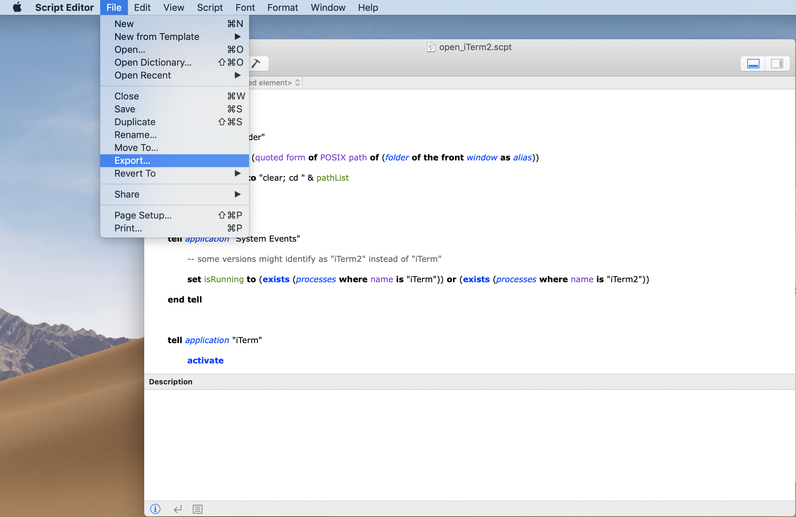
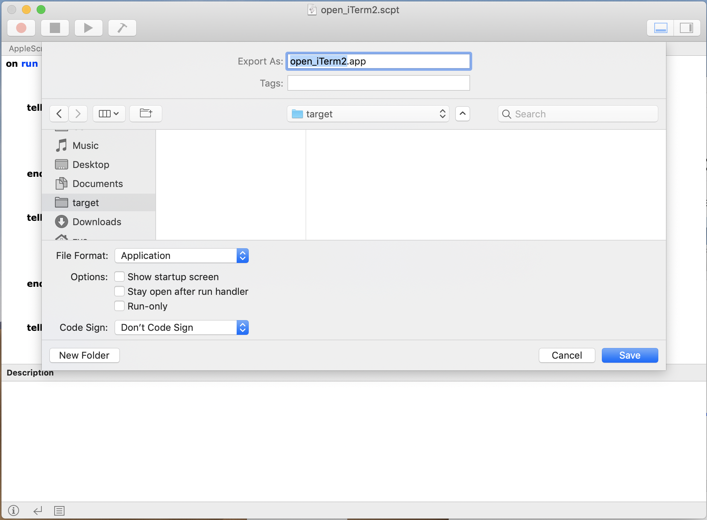
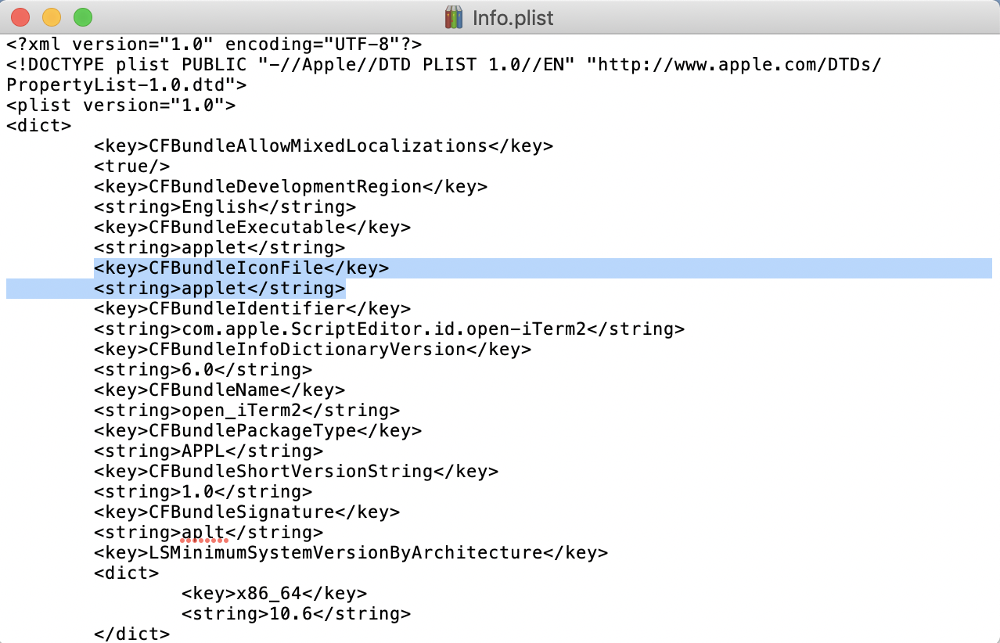

# macOS_tools
Few useful tools for macOS

## Open iTerm2 or Terminal in current Folder

- Open the Script - either [open_terminal.scpt](open_iterm2_terminal/open_terminal.scpt) or [open_iTerm2.scpt](open_iterm2_terminal/open_iTerm2.scpt) , and then choose **File** -> **Export**

  

- Choose export as **Application**, and put it anywhere you like. Then **Save**.

  

- (Optional) You can change the icon of your app: Find your app, then right click on it and choose **Show Package Contents**. Go into Contents/ , and use a text editor to open info.plist, you can find the item with icon name. Then you can edit it and put yours in the **Resources** directory, or you can just place yours in it and rename it as **[applet.icns](/images/open_iterm2_terminal/appleticns)**.

  

- Finally, find your app, then press and hold the **Command** key, drag your app to the tool bar. Then we're done! Whenever you want to open iTerm2 or Terminal in the current directory, just click on it.

  

## Keyboard Mapping: Karabiner-Elements
Karabiner-Elements is a powerful utility for keyboard customization on macOS Sierra (10.12) or later. Since programmers prefer machanical keyboards and most of those keyboards are for windows, Karaviner-Elements becomes a great software solution.

[official site](https://pqrs.org/osx/karabiner/)
[github](https://github.com/tekezo/Karabiner-Elements)
